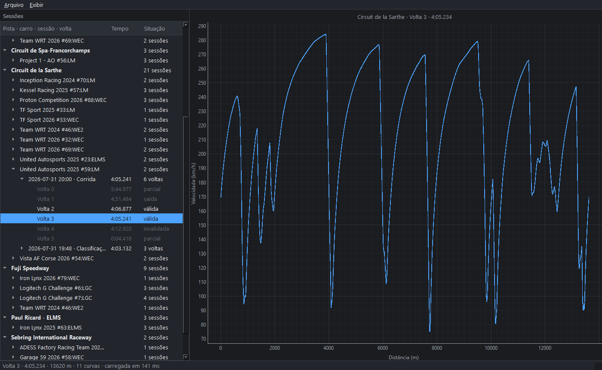
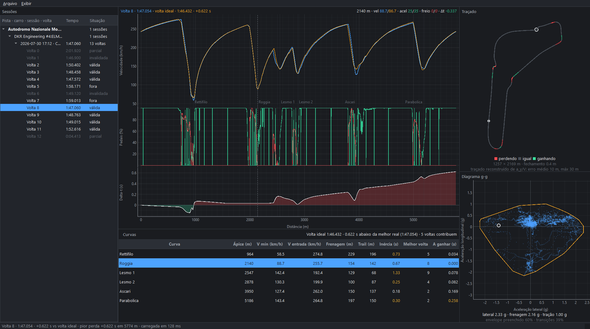
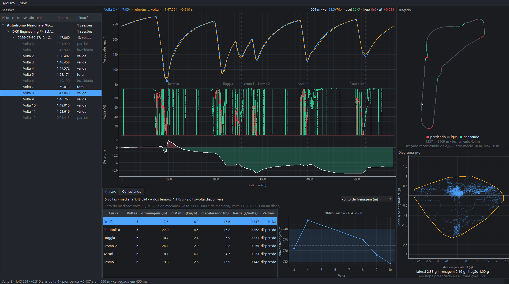

# LMU Telemetry Analyzer

Post-session telemetry analysis for [Le Mans Ultimate](https://www.lemansultimate.com/).
Reads the simulator's native DuckDB session files and turns them into the kind
of debrief a race engineer would hand a driver: corner-by-corner comparison
against a reference lap, a theoretical ideal lap, consistency ranking across a
stint, and a grip envelope.

Runs fully offline. The application makes no network calls of any kind.

> Interface is in Portuguese; code, identifiers and documentation are in English.

**Status: complete — all 10 phases.** Ingestion, the historical catalog, the analysis layer,
a desktop interface that overlays two laps channel by channel — with the
delta-t between them, the circuit they were driven on, the grip envelope they
used, a corner-by-corner debrief against a theoretical ideal lap and a
per-corner repeatability report across a stint — and export to PNG, CSV and a
PDF debrief.

Every formula, its assumptions and where it breaks down: **[docs/methodology.md](docs/methodology.md)**.



*Two laps of the same Monza race. Lap 8 is 0.510 s faster overall but loses
0.187 s at the Variante del Rettifilo — the only red step in the delta-t row,
at 990 m, and the only red stretch on the map. The corner names are the user's
own and are stored per track. The dashed outline behind the circuit is the
track rebuilt from lateral acceleration alone, with no position data: 10 m mean
error over a 5.8 km lap.*



*The same lap against the theoretical ideal. The delta rises to +0.622 s at the
line, and the "A ganhar" column says where those 0.622 s are: 0.258 at the
Parabolica, 0.169 at Ascari. Five different laps contribute, which is exactly
how optimistic the target is.*



*Repeatability across the stint, ranked worst first. The Rettifilo costs
0.747 s a lap — and the plot says why: the braking point marches from 747 m
down to 724 m over five laps, which is a drift, not scatter, and is far more
likely to be tyre state than the driver.*

---

## Why this exists

I am a mechanical engineering student and I race in LMU. Two goals, equally
weighted: a tool I actually use to go faster, and a portfolio piece for
automotive engineering roles. That shapes the design - every formula that
involves physics is documented with its assumptions and with where it breaks
down, rather than being presented as a black box.

---

## The data format

Since version 1.2 the game writes telemetry natively to DuckDB, one file per
session, in `UserData/Telemetry`:

```
Circuit de la Sarthe_R_2026-07-30T20_44_16Z.duckdb
```

There is **no telemetry table**. There is one table per channel, in one of four
column layouts:

| Layout | Columns | Meaning | Example |
|---|---|---|---|
| A | `value` | continuous, single valued | `Engine RPM` |
| B | `value1..value4` | continuous, per wheel | `TyresPressure` |
| C | `ts`, `value` | event, single valued | `Gear` |
| D | `ts`, `value1..value4` | event, per wheel | `TyresCompound` |

Three catalog tables describe the rest: `channelsList` (name, frequency, unit),
`eventsList` (name, unit) and `metadata` (key/value).

### The part that matters

**Continuous channels carry no timestamp.** Time is implicit in the row index:

```
t[i] = i / frequency
```

That turns ingestion into index arithmetic instead of a temporal join. It also
means that if the game stalls mid-recording, index and time stop corresponding
and every downstream alignment lies with no error raised anywhere.

The correction is not a feature, it is a required part of ingestion:
`GPS Time` is a continuous channel carrying a real clock, recorded at 100 Hz.
Ingestion compares the index-derived time against it and, past a configurable
tolerance, rebuilds the time base from `GPS Time` and raises a visible warning.

---

## Verified schema

Schema verification is phase 1's deliverable, not an assumption. Run it against
your own files:

```bash
python scripts/inspect_schema.py "path/to/session.duckdb"
```

Pass several files to compare their schemas. `--json out.json` writes a
machine-readable summary.

List the laps of a session, which exercises the whole ingestion path:

```bash
python scripts/list_laps.py "path/to/session.duckdb"
```

```
  volta        tempo    medido       S1       S2       S3  situação
  --------------------------------------------------------------------
    0     2:01.920   229.468   47.954  38.928  35.038  parcial
    1        --      106.900   35.391      --      --  invalidada
    2     1:50.402   110.420   39.045  36.521  34.836  válida
    5     1:58.171   118.180   35.488  47.303  35.380  fora da pista, válida (3.4%)
    8 *   1:47.060   107.060   35.717  36.283  35.060  válida
```

It ends with an independent cross-check: `Lap Dist` resets to zero at every
start/finish crossing, so the reset must land on the reconstructed lap boundary.
It does, within one sample of a channel that was never involved in producing
those boundaries.

What inspecting three real sessions (Practice, Qualifying and Race; a GT3 and
an LMP3) established:

- **101 tables**: 98 channels + 3 catalog tables. Identical across all three
  session types and both cars.
- **Layout counts**: 42 × A, 16 × B, 38 × C, 2 × D. No unrecognised layouts.
- **Catalog is exact**: every channel has a table, every table has a catalog
  entry, 98 = 98.
- **The implicit time base holds.** `GPS Time` is monotonic with a step of
  exactly 0.010000 s (median, minimum *and* maximum), and its measured span
  matches `(n-1)/frequency` to within 0.0000 s. No stall in any session tested.

Three findings that changed the design:

1. **`channelsList.frequency` is an `INTEGER` column**, so a channel whose real
   rate is not a whole number is stored truncated. `Engine Oil Temp` and
   `Engine Water Temp` are declared at 7 Hz and actually run at 7.017 Hz -
   believing the declared value puts them 3.5 s out of position by the end of a
   24-minute session. Ingestion derives the rate empirically instead,
   `f = (n-1) / gps_time_span`.

2. **Some continuous-layout channels carry discrete values.** `TC` and
   `OverheatingState` are `BOOLEAN` in layout A, `SurfaceTypes` is `UTINYINT`
   in layout B. Interpolating them would invent a surface type halfway between
   asphalt and kerb. Discreteness is read from the column type, not from the
   layout.

3. **`metadata` identifies the car**, so importing never has to ask:
   `CarName`, `CarClass`, `TrackName`, `TrackLayout`, `WeatherConditions`,
   `SessionType`, plus a full `CarSetup` JSON blob.

### Units the files declare

Conversion is driven by the `unit` column, never by a hand-written per-channel
table. Canonical internal units: m/s, m, s, deg, 0-1 pedals, g, degC, kPa.

Two worth knowing about, because they are easy to get wrong:

- `Ground Speed` is in **km/h**, while `GPS Speed` and `Wheel Speed` are in m/s.
- Pedals and `Steering Pos` are in **percent**. Every analysis threshold is
  expressed as a fraction, so the 0-100 → 0-1 conversion is on the critical
  path. `Steering Pos` is percent of full lock, *not* degrees; converting it to
  an angle needs the steering lock from the `CarSetup` blob.

### Two channels are mislabelled

**`G Force Lat` holds longitudinal acceleration and `G Force Long` holds
lateral acceleration. Both are negated.**

Neither acceleration needs the G channels to be measured. Longitudinal is
`dV/dt` from `Ground Speed`; lateral is `V·ω` with `ω` from the wheel-speed
asymmetry and the track width. Correlating each channel against both references
over full race sessions at three tracks with two cars:

| channel | vs `dV/dt` | vs `V·ω` | is really |
|---|---|---|---|
| `G Force Lat` | **−0.997** | −0.075 | longitudinal, negated |
| `G Force Long` | −0.074 | **−0.987** | lateral, negated |
| `G Force Vert` | +0.058 | +0.164 | vertical, correct |

A 0.5 s moving average moves the correlations by less than 0.01, so it is not a
noise artefact. Two independent checks agree: through a sustained 70 km/h corner
at constant speed `G Force Lat` stays near zero and `G Force Long` holds −1.5 g,
and under heavy straight-line braking `G Force Long` averages −0.02 g.

This is not cosmetic. The g-g diagram would plot longitudinal acceleration on
its lateral axis, and the track-map reconstruction from `ω = a_y / V` would
integrate the wrong channel entirely.

Use `session.acceleration("lateral" | "longitudinal" | "vertical")`, which
returns correctly labelled values in g — positive longitudinal under
acceleration, positive lateral in a right-hand corner (SAE convention). The raw
channels remain reachable under their file names via `session.channel(...)`.
`tests/test_physical_validation.py` re-derives the whole result on every run, so
a game update that fixes the labelling fails the suite instead of silently
inverting every sign.

### Wheel order is FL, FR, RL, RR — verified, not assumed

Nothing in the file says which of `value1`..`value4` is which wheel. Two
independent physical checks settle it:

- **Front/rear** from brake temperature: the front brakes do most of the work,
  and wheels 1,2 run 60 °C hotter than 3,4 (283 °C vs 223 °C at Le Mans,
  387 vs 330 at Monza).
- **Left/right** from cornering kinematics: the outside wheels run a larger
  radius and turn faster. Grouped by steering sign, the asymmetry between
  wheels (1,3) and (2,4) flips direction and is worth about 0.7 m/s each way.

Tyre temperature is useless for this — it has seconds of thermal inertia and
reflects the whole lap's balance rather than the corner you are in. It never
flips sign between left and right corners, which is what made the kinematic
check necessary.

### Lap structure

- **`Lap`** fires at each start/finish crossing with the new lap number; lap *k*
  runs from its event to the next.
- **`Lap Time`** fires at the same instant with the time of the lap that just
  *ended*, matching the gap between crossings to within 0.02 s. **Exactly zero
  means the game invalidated the lap** — that ruling is about track limits,
  which no channel records, so it is taken as authoritative.
- **`Last Sector1` and `Last Sector2` are cumulative**, not per-sector. Sector
  durations are `S1`, `S2 − S1`, `LapTime − S2`. Verified against `Current
  Sector` transitions, and the three durations sum to the lap time exactly.
- The first and last lap of every session are partial, because recording starts
  and stops mid-lap. Normal, flagged, not discarded.
- **Off-track does not imply an invalid lap.** A Monza lap with a
  near-stationary excursion onto grass stayed valid, while laps with no
  off-track sample at all were invalidated. The two are reported independently.

Surface codes were identified by correlating each with speed: 0 = track
(~176 km/h), 2 = grass (18 km/h during a real excursion), 4 = gravel (39 km/h),
5 = kerb (128 km/h and the highest lateral g — being ridden), 6 = another legal
surface. Configurable in `config/defaults.toml`.

### Channels that do not exist

`Yaw Rate`, `Lateral Acceleration`, `Longitudinal Acceleration`, `Steered Angle`
and the aerodynamics channels are **not recorded**. Accelerations are available
only through `G Force Lat`, `G Force Long` and `G Force Vert`. No code depends
on the absent ones; the inspection script flags it loudly if one ever appears.

---

## Getting started

Requires Python 3.11+ (developed on 3.14).

```powershell
uv venv                                  # or: python -m venv .venv
uv pip install -r requirements.txt       # or: .venv\Scripts\pip install -r requirements.txt
.venv\Scripts\Activate.ps1               # so that `python` and `pytest` mean the venv's
pytest -q
```

Tests that need a real session file skip themselves when none is present, so a
clone without the game installed still gets a green run. Point them at your own
folder with `LMU_TELEMETRY_DIR`.

---

## Running it

The dependencies live in the project's virtual environment, **not** in the
system Python, so the interpreter matters:

```powershell
.venv\Scripts\python.exe main.py
```

or activate the environment first, after which plain `python` is the right one:

```powershell
.venv\Scripts\Activate.ps1
python main.py
```

Running `python main.py` without activating picks up whichever Python is first
on PATH — usually the system one — and fails with `No module named 'PySide6'`.
`main.py` checks for this and prints the command to use instead.

Import sessions from **Arquivo ▸ Importar pasta...**, pointing at the game's
`UserData/Telemetry`. The tree groups them track ▸ car ▸ session ▸ lap, since
laps are only comparable within one track and one car. Laps that cannot be
compared — partial, invalidated, or touching the pit lane — are dimmed rather
than hidden: they still hold telemetry worth looking at.

The window opens on the fastest comparable lap of the most recent session, which
is almost always the lap you just drove. A lap loads in about 150 ms; the
session file stays open so moving between laps of one session is instant.

When a session's clock had to be corrected against `GPS Time`, an amber banner
says so at the top of the window. That is not decoration — it is the only sign
that a recording stall shifted everything after it.

Tests run headless against Qt's `offscreen` platform, so the interface is
covered in CI with no display.

---

## Analysis

```bash
python scripts/analyse_session.py "path/to/session.duckdb"
```

Distance is rebuilt by integrating `Ground Speed` at 100 Hz (0.7 m between
samples) rather than read from `Lap Dist` at 10 Hz (6.9 m at 250 km/h, which
cannot locate a braking point), then rescaled to close on the known lap length.
Every comparison then happens on a 1 m distance grid — two laps cover the same
metres, not the same seconds.

Run against a real Le Mans lap, the corner detector reads the circuit back:

```
  curva      ápice    v_mín   v_entr  frenagem  dist.fren  retomada
  C4          4119    106.5    280.8      3905        214      4119     Mulsanne chicane 1
  C6          7740     81.2    266.9      7575        165      7740     Mulsanne corner
  C7          9850    110.0    274.8      9519        331      9850     Indianapolis
  C8         10165     75.9    176.9     10072         93     10165     Arnage
  C10        12297    169.0      n/d       n/d        n/d     12297     taken without braking
```

Arnage at 75.9 km/h really is the slowest corner at Le Mans, and C10 correctly
reports no braking point rather than inventing one.

The track map cross-checks itself. The GPS projection gives a bounding box of
2597 × 5441 m against the real circuit's ~2.6 × 5.4 km and closes to 0.3 m; the
independent reconstruction from `ω = a_y / V`, which uses no position data at
all, stays within 10 m mean of it at Monza.

**The theoretical ideal lap is not a record.** Exit speed from one segment sets
entry into the next, so stitching the best segments produces a target that is
probably optimistic. Segment boundaries sit midway along the straight between
corners, never at an apex, and the speed discontinuities at the seams are
reported so they can be drawn rather than smoothed away — they are the evidence
that the lap never happened.

Two corrections came out of running the analysis on real data rather than only
on the synthetic circuit:

- **Corner detection works from "where is the car slow", not from peak-picking.**
  A corner held at the cornering limit produces a perfectly flat speed plateau,
  and smoothing rings at its shoulders, so peak-picking found two minima at the
  edges of every corner and none in the middle.
- **Time lost per corner is measured, not modelled.** Estimating it from apex
  speed as `L·(1/V − 1/V_best)` claimed 26 s of loss in one Monza corner of a
  107 s lap, because a corner's window spans the whole stretch to its
  neighbour. Reading each lap's time through the corner directly and comparing
  against the driver's own best has no such failure mode.

A third came out of drawing the gear trace for the first time in phase 6:

- **Event channels carry their own clock.** Layouts C and D have a `ts` column
  and are written only when the value *changes*; layouts A and B have no
  timestamp at all and rely on `t[i] = i/f`. Ingestion was applying the
  implicit grid to both, which spread `Gear`'s 962 shift events uniformly at
  1.5 s apart instead of placing them at the instants they happened. Since half
  of those events are the momentary neutral of a shift, the car appeared to be
  out of gear for half of every lap. Nothing before phase 6 read an event
  channel through that path, so nothing caught it.

### Comparing two laps

Comparison happens in the distance domain and nowhere else. Two laps at the
same *elapsed time* are at different points of the circuit, so any difference
between them is a statement about nothing. The interface enforces this rather
than documenting it: the time axis is available for reading a single lap's
rhythm, and is disabled while two laps are drawn.

The delta is `delta(s) = t_lap(s) − t_reference(s)`, positive when the lap is
behind. What matters is the **slope**, not the value: a rising delta is where
time is being lost right now, while a flat delta at a high value is a loss that
happened earlier and is simply being carried. The row is filled to zero, red
above and green below, so the eye follows the slope.

A reference lap from a different circuit is refused, because a shared distance
grid would silently compare Monza's 4 000 m mark with Le Mans's. A reference
from a different *car* is allowed but flagged — comparing two cars around one
circuit is a legitimate thing to want, as long as it is clear that the delta
then measures the car as much as the driving.

One thing the gear trace shows that looks like a fault and is not: it drops to
neutral for roughly 2 m at every shift. Those are real events — the game logs
the ~37 ms the dog ring spends out of engagement — and they are left in rather
than filtered out.

### Where the lap happened

A delta row says a lap lost 0.19 s around 990 m. Translating that into "the
first chicane" is work the driver should not have to do, so the track map does
it: the circuit is drawn from the lap's own GPS trace and coloured by where
time moved. **Coloured by the delta's slope, never its value** — colouring by
value paints the whole second half of the lap red because of one mistake at
turn one.

The path is drawn as runs of constant colour, one polyline per run, which keeps
a 13 600-point Le Mans lap to a few dozen items and draws as a line rather than
a string of dots at any zoom. Aspect ratio is locked: Monza's bounding box is
1257 × 2169 m and it has to stay that shape.

A second colouring shows braking, coasting and throttle. Coasting is the one
worth having on a map: as a number it is 2% of a lap and easy to dismiss, and
as a stretch of tarmac between the brake release and the throttle it is
obviously a corner entered too slowly.

The reconstruction built in phase 4 — heading integrated from `omega = a_y / V`,
using no position data at all — can be overlaid on top, rotated onto the GPS
trace because its absolute orientation is unknowable. It closes to within 3 m
over a 5.8 km Monza lap with 10 m mean error, and 37 m mean over Le Mans's
13.6 km. It is a cross-check on the quasi-steady assumption, not a measurement,
and is drawn dashed and dim to say so.

### Reading the grip envelope

The g-g diagram is a scatter of lateral against longitudinal acceleration with
the convex hull outlined over it, on equal axes — one g of braking as tall as
one g of cornering, or a circular envelope reads as an elliptical one. The
outline is drawn because the numbers underneath are computed from it, which
makes them auditable by eye instead of asserted.

The accelerations behind it were verified against two independent derivations
before the panel was built, because the channels are mislabelled in the file
and a sign error here is invisible:

| | recorded channel | independent estimate | correlation |
|---|---|---|---|
| longitudinal | −2.32 / +1.26 g | `dV/dt`: −2.36 / +0.90 g | 0.9925 |
| lateral | 2.84 g peak | `V·ω` from wheel speeds: 3.11 g peak | 0.9814 |

A GT3 at Le Mans reaching 2.8 g lateral is above what the real car does. The
two derivations agree, so that is the simulation's grip level rather than a
fault in this pipeline — worth knowing before anyone reads the number as a
real-world figure.

### The corner table, and what a corner is worth

Everything above shows what the lap looked like. The table says what to do next.
Per corner: apex position, minimum and entry speed, braking length, how far
braking continued past turn-in, and time spent on neither pedal. Coasting is the
one that pays — it is the cost of an unresolved decision between brake and
throttle, and it is invisible on a speed trace.

With a comparison loaded it also carries the time and minimum speed each corner
gave away. With the ideal lap it carries the two columns that matter most:
which lap of the session drove this corner best, and what matching it is worth.
That column, read top to bottom, is the practice list.

**Corner names are anchored to a distance, not to a corner number.** The number
shifts the moment the detector finds one more or one fewer corner — a wet lap, a
lap with a spin, a lap where two corners joined by a throttle burst failed to
separate. A name pinned to an index would then move to the wrong corner and
quietly stay wrong. Names are stored per track and survive re-importing every
session ever recorded there.

### The ideal lap

The lap is cut into segments — boundaries midway along the straight between one
apex and the next, never at an apex, so a corner's braking, apex and exit stay
in one segment — and each segment is credited to whichever lap was fastest
through it.

**It is a target, not a record, and the interface says so.** Exit speed from one
segment conditions entry into the next, so a lap that was quickest through
segment 3 may have been quickest precisely because it sacrificed the entry to
segment 4. The summary line states how many laps contribute, because that is
how optimistic the target is: one means the ideal lap *is* a real lap. The
seams where the stitched speed trace jumps are marked on the chart rather than
smoothed away — they are the evidence that the lap is synthetic.

Drawing a delta against it exposed a defect in the phase-4 stitching: elapsed
time was spread linearly across each segment, which assumes constant speed
through it. A Monza segment runs from 275 km/h on the straight to 58 km/h at the
apex, so the ideal lap's clock was about a second wrong in the middle of every
segment. Invisible in the lap total — that is the sum of the segment times
either way — and the dominant term in any delta drawn against it. Using each
winning lap's own elapsed profile instead took the worst apparent loss against
the ideal from a fictitious +1.076 s down to the real +0.622 s at the line.

### Consistency

Lap times hide repeatability. Two drivers with the same average lap time can be
very different: one repeats the same lap, the other alternates a good lap with a
bad one. Only the second has something easy to gain, and only a per-corner
measurement shows where.

Per corner, across a stint: the spread of the braking point, of the apex speed
and of the throttle resumption point, and the time that spread costs — measured
as `mean(t) − min(t)` through the corner's own stretch of track, not modelled
from apex speed. Ranked worst first, because a driver cannot work on twelve
corners at once.

**Beside the ranking, the same corner plotted lap by lap, and the pairing is the
point.** A drift and a scatter have identical standard deviations and completely
different causes. A braking point creeping 20 m over five laps is tyre or fuel
state; the same 20 m jumping about is the driver. The table gives the number,
the plot shows which it is, and a column states the answer.

Measured per stint. Across a pit stop fuel load and tyre age both step, so the
dispersion would be reporting the car's state as the driver's repeatability.

Two things the real data corrected:

- **A purely relative lap filter does not survive a change of circuit.** 5% of a
  108 s Monza lap is 5.4 s; 5% of a 245 s Le Mans lap is 12 s. The relative rule
  alone admitted a lap taken through the first chicane at 28 km/h — an incident,
  not driving — and that one lap tripled the corner's reported dispersion
  (17.1 km/h of apex spread against a true 6.2) and inflated the whole stint's
  available time from 2.07 to 2.65 s a lap. An absolute allowance alongside it,
  tighter of the two winning, makes the rule mean the same thing everywhere.
- **"Is it drifting" is a question about order, not about linearity.** A linear
  correlation called the Parabolica a drift from the braking points 5007, 4996,
  5005, 5005, 4955 m — four flat laps and one late outlier, whose magnitude
  carried the entire statistic. Ranking first makes one stray lap move the
  answer by one rank instead of by fifty metres.

### Layering

`analysis` imports numpy, scipy and the standard library — nothing else.
`tests/test_architecture.py` walks the **transitive** import closure to enforce
it, because a direct-imports-only check passes happily while `analysis` reaches
`ingest` through `core`. `lmu_telemetry/pipeline.py` is the seam that joins
ingestion to analysis, and is what the UI will use.

---

## Storage

Everything the app writes lives under `~/.lmu-telemetry` (override with
`LMU_TELEMETRY_DATA_DIR`). Nothing is ever written next to the game's files, and
session files are opened read-only.

```bash
python scripts/import_session.py --folder "path/to/UserData/Telemetry"
python scripts/import_session.py --show
```

The **catalog** (`catalog.duckdb`) answers what a single session cannot: the
best lap ever at a track in a car, what the corners are called, which sessions
exist. Keys are natural — a session's id is its source file's SHA-256, a lap's
is `<session_id>:<index>` — so re-importing a file updates it in place and
import is idempotent without checking first.

`best_laps` is a **view**, not a table. The specification lists it among the
tables, but a stored best lap goes stale the moment a session is re-imported or
deleted, and a wrong personal best is worse than none.

### Why channel data is not cached

The specification asks for the normalised telemetry to be persisted to parquet.
Measured on real sessions, that is a bad trade:

| | |
|---|---|
| read 5 chart channels from the game's file | 3.8 ms |
| read the same 5 columns from a parquet copy | 2.9 ms |
| size of a 100 Hz parquet copy | **1.95×** the source (52 MB from 26.7 MB) |

The source is already a compressed columnar database, so re-encoding it buys
about a millisecond and costs twice the disk — roughly 1.9 GB for 64 sessions.
Dropping the 26 channels that never vary saves nothing either; constant columns
already compress to almost nothing.

What *is* expensive is opening a session: 83 ms, of which 53 ms is building the
channel registry from one `DESCRIBE` and one `COUNT(*)` per channel. Browsing 64
sessions costs about 5 s before anything is drawn. So the cache stores the
**manifest** — identity, time base, channel registry, lap table — at a few
kilobytes each. The whole cache for 64 real sessions is **1.2 MB**.

Phase 4 adds the artifact that genuinely is expensive to recompute: per-lap
frames on a 1 m distance grid, which need cumulative integration of speed and a
per-lap scale correction. Those land in `laps/` inside the same session folder
and reuse the same hash invalidation.

---

## Architecture

Five layers, dependencies strictly in one direction.

```
lmu_telemetry/
├── ingest/     # the only layer that knows the file format exists
├── core/       # models, units, errors. Depends on nothing.
├── analysis/   # numpy arrays in, numbers out
├── storage/    # parquet cache + historical catalog
├── ui/         # PySide6. All user-visible text lives in ui/strings.py
└── export/     # PNG, CSV, PDF report
```

**`analysis` may not import `ingest`, `ui`, `storage`, `export`, `duckdb`,
`pandas` or Qt.** It takes numpy arrays and returns numbers. That is what lets
every formula be tested without the game installed, and what would let a live
data source feed the same functions later without touching an equation. The
rule is enforced mechanically by `tests/test_architecture.py`, which parses
imports with `ast` rather than grepping.

On-screen charts use `pyqtgraph` because a long session is hundreds of
thousands of points per channel and zoom has to stay fluid; `matplotlib` is
used only for export, where print quality matters more than interactivity.

---

## Export

Everything on screen can leave the application, from the interface
(**Arquivo ▸ Exportar**) or from a script:

```bash
python scripts/export_session.py "session.duckdb" --lap 8 --out out/
```

That writes five files: the traces as a print-quality PNG, the lap's channels as
CSV (one row per metre), the corner table, the consistency ranking, and a PDF
debrief with all of it plus the charts.

**The exports redraw rather than screenshot.** `pyqtgraph` draws the screen
because a long session is hundreds of thousands of points and panning has to
stay fluid; it is the wrong tool for something printed, and a screenshot of a
dark interface is unreadable on paper. `matplotlib` redraws in a light palette
at print resolution. That means the two renderers have to agree, so the unit
conversions live in one place and an exported number always equals the number
that was on screen.

**CSVs come in two dialects.** Comma delimiter with a dot decimal is what
pandas, R and every other tool expects; semicolon with a comma decimal is what a
Brazilian or Italian Excel opens correctly on a double click. Writing only the
first shows the user's own spreadsheet one column of garbage; writing only the
second means no tool can read it.

**The PDF carries its own caveats.** A report outlives the session it came from
and gets forwarded to people who were not there. The ideal lap's "this target is
not guaranteed to be achievable", the fact that distance is reconstructed rather
than recorded, and the fact that the acceleration channels arrive mislabelled
are reproduced in the document rather than assumed to be remembered.

Nothing in `lmu_telemetry/export/` imports Qt, so a report can be produced over
SSH or in CI. `matplotlib` is pinned to the Agg backend on import.

---

## Privacy

**What is actually in the files.** Inspected across all 66 sessions recorded on
the development machine, `metadata` holds thirteen keys and exactly one of them
is personal: `DriverName`. `SteamID` is present but reads `0` in every file.
`CarName` reads like a team — "Inception Racing 2024 #70:LM" — but is the livery
selected in game, which is published product content. No nationality and no
server name appear anywhere, and `metadata.value` is the only free-text column
in the entire schema.

That is **narrower than this project's specification assumed**, and it is
reported rather than quietly relied on.

Raw `.duckdb` files are excluded by `.gitignore`. The anonymised demo dataset in
[`data/demo/`](data/demo/) is the only session file ever committed:

```bash
python scripts/make_demo_dataset.py "session.duckdb"
```

Two rules, both absolute:

1. **The original is never modified.** Anonymisation copies first and edits the
   copy. A tool that can damage the only record of a session is worse than no
   tool.
2. **The name is removed everywhere, not from a list of fields.** The known keys
   are cleared by name, and then every free-text cell in the file is swept for
   any residue — a field the code does not know about is exactly the field that
   would leak.

The written file is re-opened and checked afterwards, because verifying the
artefact rather than trusting the writer is the only check that means anything
before publishing one. `tests/test_export.py` runs that check against the
committed demo on every test run, and fails if a game update ever adds a
metadata key nobody has reviewed.

### Trying it without the game

```bash
python scripts/list_laps.py "data/demo/Autodromo Nazionale Monza_Q_2026-07-30T17_03_52Z.duckdb"
python scripts/import_session.py "data/demo/"
.venv\Scripts\python.exe main.py
```

Monza qualifying, three comparable laps — enough for the comparison, the ideal
lap and the consistency panel.

---

## Roadmap

| Phase | Scope | Status |
|---|---|---|
| 1 | Schema verification, catalog reading, channel registry | ✅ done |
| 2 | Time base with `GPS Time` validation, step events, lap splitting | ✅ done |
| 3 | Session cache + historical catalog | ✅ done |
| 4 | Full analysis layer with unit tests on synthetic data | ✅ done |
| 5 | Minimal UI: session browser + speed trace | ✅ done |
| 6 | Synchronised multi-channel charts + delta-t | ✅ done |
| 7 | Track map + g-g diagram | ✅ done |
| 8 | Corner table, persistent naming, theoretical ideal lap | ✅ done |
| 9 | Consistency panel | ✅ done |
| 10 | Export (PNG/CSV/PDF), demo dataset, docs | ✅ done |

Deliberately out of scope: live telemetry, HUD/overlay, 3D, tyre degradation
modelling and fuel strategy. The ingestion layer is designed so a live source
could be added later, but that source is not being built.

---

## License

Not affiliated with Studio 397, Motorsport Games or the ACO.
